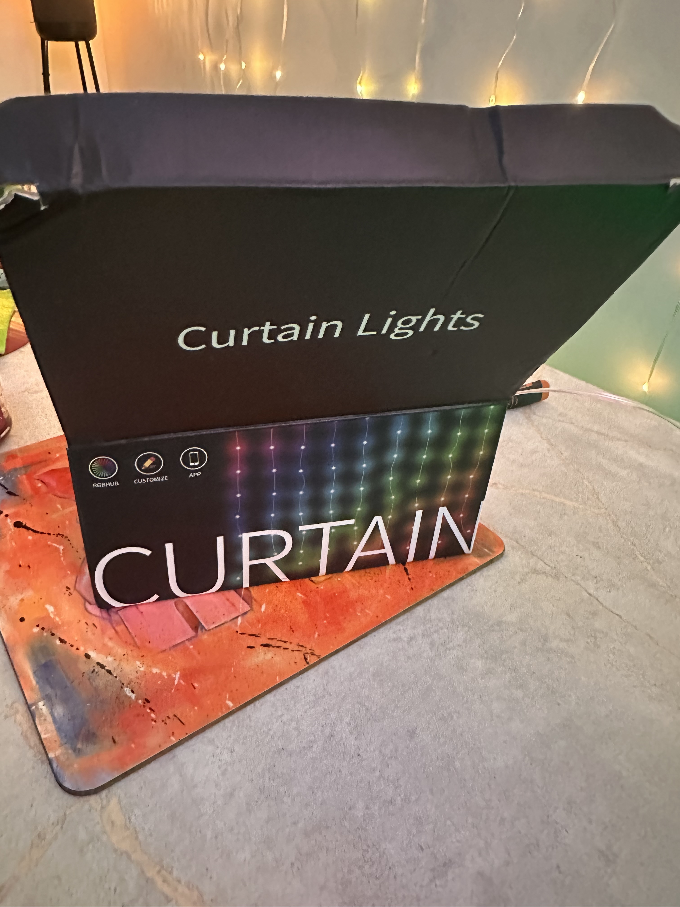
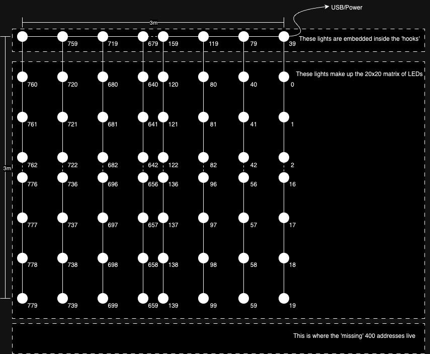

# Hello Fairy 3mx3m 400 light LED Curtain

Can buy relatively cheaply from aliexpress etc. e.g. https://www.aliexpress.com/item/1005007552167440.html

The hello fairy app that it comes with is pretty good and it uses some proprietrary BLE to communicate with it. Trying to integrate to home-assistant via https://github.com/Alwinator/ha-hello-fairy-integration was a failure, so moved it wled32 so I could control it's state more effectively!

The box looks like 

The addressing is a bit weird on them with each of the 20 strings exposing 40 addresses, but there only beeing 21 LEDs present (the top one being part
of the provided hook.) ( Probably like these kinda things https://github.com/Aircoookie/WLED/issues/1312 )

The natural addressing looks like : 

With this information the ledmap.json file here: [ledmap.json](ledmap.json) can be uploaded to WLED

The LED configuration should be WS281x and specified as a length of 800 (not the 400 you'd perhaps assume.)

The 2d Matrix configuration should specify the 1st LED as Top Left (the led map provided accounts for this) with a width and height of 20x20. It is *not* serpentine. Vertical orientation and an offset of 0x0.

With these settings, all the matrix effects appear to work just fine, and if you're like me and 3m was wayyy too big, you can correctly set the stopy at the height you want for your wall size and the remaining LEDs will be left un-lit, you can probably trim the strands, but I've not tested that so YMMV.